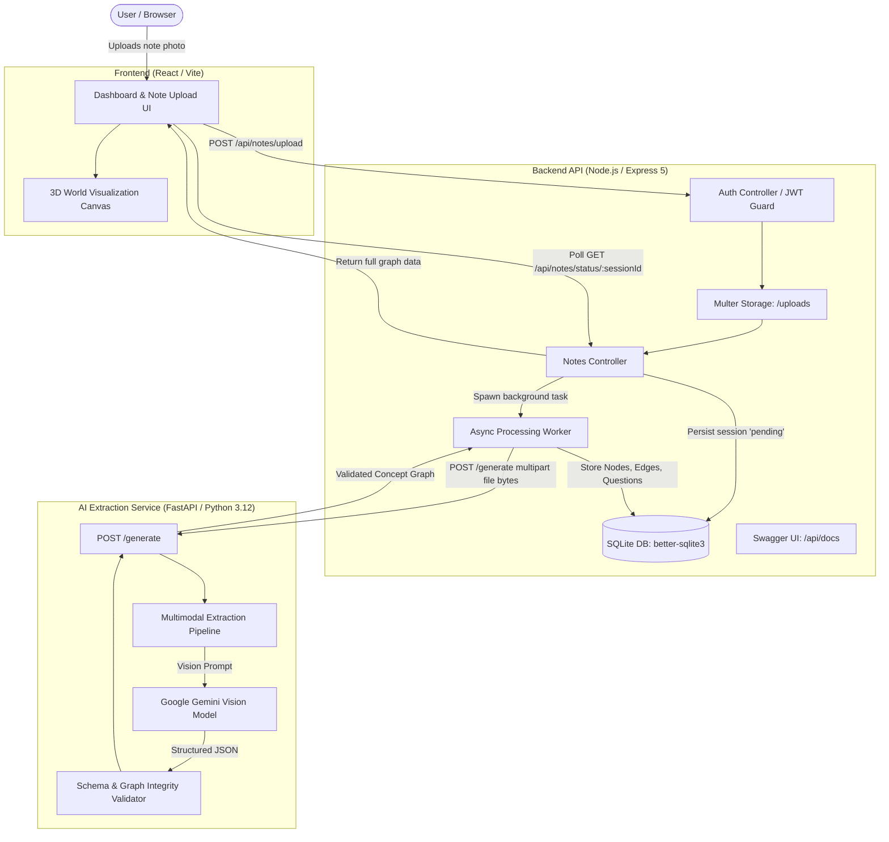

# Syntropy 🧠✨

> **Transform messy handwritten notes into interactive 3D concept graphs and active-recall quizzes powered by multimodal AI.**

[](https://nodejs.org/)
[](https://www.python.org/)
[](https://fastapi.tiangolo.com/)
[](https://expressjs.com/)
[](https://sqlite.org/)
[](https://ai.google.dev/)
[](http://localhost:3000/api/docs)

---

## 📖 Overview

**Syntropy** is an end-to-end learning acceleration platform. It bridges the physical and digital study spaces by turning photos of notebook pages, diagrams, or whiteboard sketches into structured, navigable 3D concept maps and interactive active-recall quizzes.

Instead of passively re-reading static notes, Syntropy:
1. **Transcribes** messy handwriting into pristine text using vision LLMs.
2. **Distills & Hierarchizes** key concepts into distinct primary, secondary, and tertiary tiers.
3. **Maps Relationships** as directed edges that capture how core ideas relate and interact.
4. **Synthesizes Active-Recall Quizzes** tied directly to specific nodes to test knowledge retention.
5. **Visualizes in 3D Space** for an intuitive, spatial learning experience.

---

## 🏛️ System Architecture



---

## ✨ Key Features

- **Multimodal Handwriting OCR:** Accurately deciphers handwritten text, diagrams, labels, and hierarchical outlines directly from uploaded images.
- **Hierarchical Concept Extraction:** Automatically groups extracted concepts by importance (`primary`, `secondary`, `tertiary`) and assigns them to topical clusters.
- **Directional Relationship Mapping:** Extracts relational verbs and dependencies between nodes (e.g. `is an example of`, `catalyzes`, `leads to`), with graph integrity validation.
- **Targeted Active-Recall Testing:** Auto-generates 3-to-4-option multiple-choice questions linked directly to individual concept nodes, complete with answer rationales.
- **Asynchronous Processing Pipeline:** Image uploads return an immediate 202 Accepted session handle, executing heavy multimodal AI workloads in the background with real-time status polling.
- **Interactive OpenAPI Documentation:** Built-in Swagger UI at `/api/docs` allows real-time exploration and testing of all endpoints.
- **JWT-Protected Secure API:** Complete user registration, password hashing (`bcryptjs`), and token-guarded note access.

---

## 🗄️ Database Schema & Data Models

Syntropy uses **SQLite** in WAL (Write-Ahead Logging) mode with strict foreign key constraints.

```
┌─────────────────┐       ┌─────────────────┐       ┌──────────────────────┐
│      users      │ 1   * │    sessions     │ 1   1 │        notes         │
├─────────────────┤◄─────►├─────────────────┤◄─────►├──────────────────────┤
│ id (PK)         │       │ id (PK)         │       │ id (PK)              │
│ email           │       │ user_id (FK)    │       │ session_id (FK)      │
│ password_hash   │       │ status          │       │ image_path           │
│ created_at      │       │ error_message   │       │ subject_title        │
└─────────────────┘       │ created_at      │       │ raw_transcription    │
                          │ updated_at      │       │ created_at           │
                          └────────┬────────┘       └──────────────────────┘
                                   │ 1
                                   │
                      ┌────────────┼────────────┐
                    * │          * │          * │
        ┌─────────────┴───┐ ┌──────┴──────────┐ ┌┴─────────────────────┐
        │    concepts     │ │  concept_edges  │ │      questions       │
        ├─────────────────┤ ├─────────────────┤ ├──────────────────────┤
        │ session_id (PK) │ │ id (PK AutoInc) │ │ session_id (PK)      │
        │ node_id (PK)    │ │ session_id (FK) │ │ question_id (PK)     │
        │ title           │ │ source_id       │ │ linked_node_id       │
        │ explanation     │ │ target_id       │ │ question_text        │
        │ importance      │ │relationship_type│ │ options_json         │
        │suggested_cluster│ └─────────────────┘ │ correct_option_id    │
        └─────────────────┘                     │ explanation          │
                                                └──────────────────────┘
```

### Concept Graph Contract (`SyntropyConceptGraph`)

The AI service enforces graph consistency through Pydantic validators:

| Field | Type | Description |
| :--- | :--- | :--- |
| `subject_title` | `string` | The synthesized subject title for the notes |
| `raw_transcription` | `string` | Complete verbatim transcription of the handwriting |
| `nodes` | `List[ConceptNode]` | Concept nodes with `node_id`, `title`, `explanation`, `importance`, `suggested_cluster` |
| `edges` | `List[ConceptEdge]` | Directed relationships connecting existing `source_id` and `target_id` nodes |
| `questions` | `List[QuizQuestion]` | Active recall questions linked directly to an existing `linked_node_id` |

---

## 🚀 Getting Started

### Prerequisites

- **Node.js** >= 18.0.0
- **Python** >= 3.12
- **Google Gemini API Key** ([Get one here](https://aistudio.google.com/))
- **Docker** (optional, for containerized AI service)

---

### 1. AI Service Setup (`ai-models/`)

#### Option A: Local Python Environment
```bash
cd ai-models

# Create and activate virtual environment
python3 -m venv venv
source venv/bin/activate  # On Windows: venv\Scripts\activate

# Install dependencies
pip install -r requirements.txt

# Set your Gemini API Key
export GEMINI_API_KEY="your-gemini-api-key"

# Start the FastAPI server
uvicorn main:app --host 0.0.0.0 --port 8000 --reload
```

#### Option B: Docker
```bash
cd ai-models
docker build -t syntropy-ai .
docker run -p 8000:8000 -e GEMINI_API_KEY="your-gemini-api-key" syntropy-ai
```

The AI extraction service will be available at `http://localhost:8000`.

---

### 2. Backend API Setup (`backend/`)

```bash
cd backend

# Install dependencies
npm install

# Configure environment variables
cp .env.example .env
```

Edit `.env` to customize settings:

```env
PORT=3000
NODE_ENV=development

# Database location
DB_PATH=./data/syntropy.db

# File upload storage
UPLOAD_DIR=./uploads

# AI microservice endpoint
AI_SERVICE_URL=http://localhost:8000/generate
AI_SERVICE_TIMEOUT_MS=120000

# JWT Authentication Secret
JWT_SECRET=your_super_secret_jwt_key_here
```

Start the backend:
```bash
# Development mode (auto-reload with nodemon)
npm run dev

# Production mode
npm start
```

Backend will be running at `http://localhost:3000`.
- API Health: `http://localhost:3000/api/health`
- Swagger UI Docs: `http://localhost:3000/api/docs`

---

### 3. Frontend Setup (`frontend/`)

```bash
cd frontend

# Install dependencies
npm install

# Point the frontend at the backend API
cp .env.example .env

# Launch Vite dev server
npm run dev
```

For production, deploy all three services and configure their public/private connections:

- Frontend: `VITE_API_URL=https://your-backend.example.com/api`
- Backend: `AI_SERVICE_URL=https://your-ai-service.example.com/generate`, `AI_SERVICE_TIMEOUT_MS=120000`, a persistent `DB_PATH`/`UPLOAD_DIR`, `JWT_SECRET`, and `CORS_ORIGIN`
- AI service: `GEMINI_API_KEY` and optionally `GEMINI_MODEL=gemini-3.1-flash-lite`

`VITE_API_URL` is a Vite build-time variable, so redeploy the frontend after changing it. The backend now transfers note bytes directly to the AI service; the two deployed services do not need a shared filesystem.

---

## 📡 API Reference

### Authentication

#### `POST /api/auth/register`
Create a new user account.

**Request Body:**
```json
{
  "email": "student@example.com",
  "password": "securepassword123"
}
```

**Response (`201 Created`):**
```json
{
  "token": "eyJhbGciOiJIUzI1NiIsInR5cCI6IkpXVCJ9...",
  "user": {
    "id": "c1f7bda9-6612-4c28-bf3a-97216a6cb39c",
    "email": "student@example.com"
  }
}
```

#### `POST /api/auth/login`
Authenticate and obtain a JWT bearer token.

**Request Body:**
```json
{
  "email": "student@example.com",
  "password": "securepassword123"
}
```

---

### Notes & Concept Graphs

All note endpoints require the `Authorization: Bearer <token>` header.

#### `POST /api/notes/upload`
Upload a note image to begin background AI processing.

- **Content-Type:** `multipart/form-data`
- **Body:** `image` (binary file)

**Response (`202 Accepted`):**
```json
{
  "session_id": "9b1deb4d-3b7d-4bad-9bdd-2b0d7b3dcb6d",
  "status": "pending"
}
```

#### `GET /api/notes/status/:sessionId`
Poll the processing state or fetch the completed graph and quiz data.

**Response (`200 OK` - While processing):**
```json
{
  "session_id": "9b1deb4d-3b7d-4bad-9bdd-2b0d7b3dcb6d",
  "status": "processing"
}
```

**Response (`200 OK` - Upon completion):**
```json
{
  "session_id": "9b1deb4d-3b7d-4bad-9bdd-2b0d7b3dcb6d",
  "status": "completed",
  "created_at": "2026-09-21 08:00:00",
  "user_id": "c1f7bda9-6612-4c28-bf3a-97216a6cb39c",
  "subject_title": "Organic Chemistry: Alkenes Preparation and Reactions",
  "raw_transcription": "From Alcohols -> Acid catalyzed dehydration...",
  "nodes": [
    {
      "node_id": "acidic_dehydration_of_alcohols",
      "title": "Acidic Dehydration of Alcohols",
      "explanation": "Heating alcohols with concentrated H2SO4 eliminates water to form alkenes.",
      "importance": "primary",
      "suggested_cluster": "Preparation of Alkenes"
    },
    {
      "node_id": "beta_elimination",
      "title": "Beta-Elimination Reaction",
      "explanation": "Removal of atoms from adjacent carbons to form a double bond.",
      "importance": "secondary",
      "suggested_cluster": "Reaction Mechanisms"
    }
  ],
  "edges": [
    {
      "source_id": "acidic_dehydration_of_alcohols",
      "target_id": "beta_elimination",
      "relationship_type": "is an example of"
    }
  ],
  "questions": [
    {
      "question_id": "q1",
      "linked_node_id": "acidic_dehydration_of_alcohols",
      "question_text": "What acid is typically used for the dehydration of alcohols to alkenes?",
      "options": [
        { "id": "A", "text": "Concentrated H2SO4" },
        { "id": "B", "text": "Dilute HCl" },
        { "id": "C", "text": "Acetic Acid" },
        { "id": "D", "text": "Nitric Acid" }
      ],
      "correct_option_id": "A",
      "explanation": "Concentrated sulfuric acid acts as a strong dehydrating agent."
    }
  ]
}
```

---

## 📂 Project Structure

```
Syntropy/
├── README.md                  # Project documentation
├── design/                    # UX specifications & design artifacts
│   └── UX_Flow.md
├── frontend/                  # React + Vite web application
│   ├── src/
│   │   ├── components/        # 3D visualization canvas & UI controls
│   │   │   └── World3D.jsx
│   │   ├── pages/             # Dashboard and World View pages
│   │   │   ├── Dashboard.jsx
│   │   │   └── WorldView.jsx
│   │   ├── App.jsx            # Main app router & layout
│   │   ├── api.js             # API client utilities
│   │   └── main.jsx           # App entry point
│   └── package.json
├── backend/                   # Node.js / Express 5 API server
│   ├── server.js              # Server entry point
│   ├── src/
│   │   ├── app.js             # Express app setup & middleware
│   │   ├── config/            # Database and Swagger OpenAPI configuration
│   │   │   ├── db.js
│   │   │   └── swagger.js
│   │   ├── controllers/       # Route controllers (Auth, Notes)
│   │   │   ├── authController.js
│   │   │   └── notesController.js
│   │   ├── middleware/        # JWT auth guard, Multer upload
│   │   │   ├── requireAuth.js
│   │   │   └── upload.js
│   │   └── routes/            # Express route modules
│   │       ├── auth.js
│   │       ├── health.js
│   │       ├── index.js
│   │       └── notes.js
│   ├── ai/                    # Bridge to Python AI microservice
│   │   ├── generate.js
│   │   └── matching.js
│   ├── database/              # SQL schema definitions
│   │   └── schema.sql
│   └── package.json
└── ai-models/                 # Python FastAPI AI extraction microservice
    ├── main.py                # FastAPI app endpoint (/generate)
    ├── prompt_to_3d.py        # Gemini multimodal graph extraction & Pydantic schema
    ├── ocr.py                 # Standalone vision OCR utility
    ├── my_first_graph.json    # Example generated concept graph artifact
    ├── Dockerfile             # Container configuration
    └── requirements.txt       # Python dependencies
```

---

## 🛠️ CLI Utilities

You can also run extraction and transcription scripts standalone from the command line:

```bash
cd ai-models

# 1. Standalone OCR transcription
python ocr.py /path/to/notes.jpg

# 2. Extract a full concept graph from one or more ordered pages
python prompt_to_3d.py /path/to/page-1.jpg /path/to/page-2.pdf --out my_graph.json
```

---

## 🗺️ Roadmap

- [ ] **Interactive 3D Force-Directed Graph:** WebGL / Three.js canvas allowing intuitive drag-and-drop navigation of connected ideas.
- [ ] **Cross-Session Knowledge Synthesis:** Connect nodes from multiple note sessions into a unified personal knowledge web.
- [ ] **Spaced-Repetition System (SRS):** Automated quiz reminders powered by active recall scheduling algorithms (SM-2 / FSRS).
- [ ] **Audio Voice Notes:** Multimodal ingestion supporting lectures and voice memos alongside handwritten notes.

---

## 📄 License

This project is licensed under the [ISC License](LICENSE).
